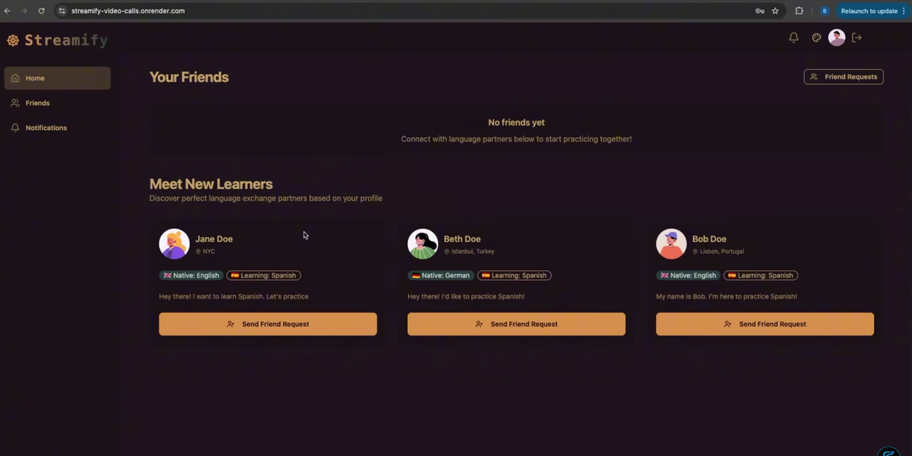
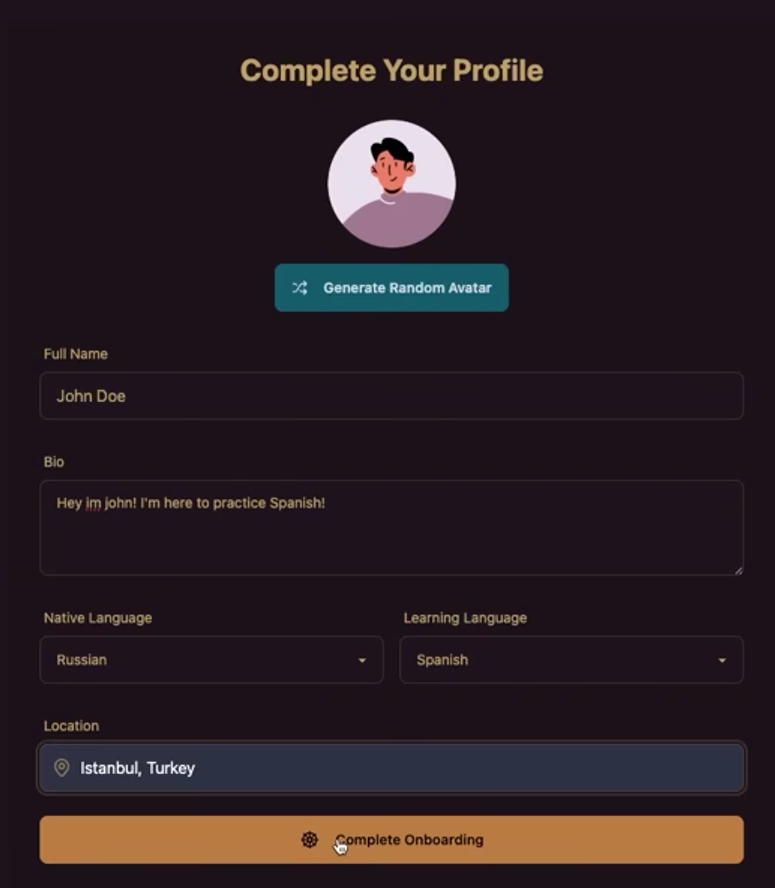

# ✨ Fullstack Chat & Video Calling App

A real-time fullstack chat and video calling application with private/group messaging, screen sharing, session recording, typing indicators, and dynamic multilingual UI. Built with the MERN stack, Zustand, and Stream API — fully secure, responsive, and scalable.


---

## 🚀 Features

- Real-time messaging with typing indicators and emoji reactions  
- 1-on-1 and group video calls with screen sharing and recording  
- Secure authentication with JWT and protected routes  
- Global state management using Zustand  
- 32 customizable UI themes for language exchange  
- Stream Chat API integration for messaging and presence  
- Responsive design for desktop and mobile devices  
- Robust error handling on both frontend and backend  
- Production-ready architecture with environment separation  

---

## 🛠 Tech Stack

- **Frontend:** React (Vite), Tailwind CSS, Zustand, TanStack Query  
- **Backend:** Node.js, Express.js, MongoDB, JWT Auth  
- **APIs & Services:** Stream API, Cloudinary

---

## ⚙️ Environment Setup

Create `.env` files in both the `backend` and `frontend` directories.

### `/backend/.env`
```env
PORT=5001
MONGO_URI=your_mongo_uri
STEAM_API_KEY=your_steam_api_key
STEAM_API_SECRET=your_steam_api_secret
JWT_SECRET_KEY=your_jwt_secret
NODE_ENV=development
```

### `/frontend/.env`
```env
VITE_STREAM_API_KEY=your_stream_api_key
```

---

## 🧪 Getting Started

1. **Clone the repository**
```bash
git clone https://github.com/your-username/your-repo-name.git
cd your-repo-name
```

2. **Start the backend**
```bash
cd backend
npm install
npm run dev
```

3. **Start the frontend**
```bash
cd frontend
npm install
npm run dev
```

4. **Access the application**

- Frontend: `http://localhost:5173`  
- Backend: `http://localhost:5001`

---

## 📸 Screenshots

| Login Interface | 
|----------------|
| |  

---

## 🔍 Highlights

- Real-time performance with WebSockets and Stream API  
- Clean, theme-switchable multilingual UI  
- JWT-secured login and role-based access  
- Zustand-powered state control  
- Built-in screen sharing and session recording  
- Mobile-first, responsive layout  
- Easy to configure, deploy, and scale

---


## 👨‍💻 Author

**Ashutosh Yadav** 
- Web Developer and competetive Programmer 
- [Codeforces](https://codeforces.com/profile/ashuy.1303)  
- [LeetCode](https://leetcode.com/u/reggie_ledoux/)  
- [CodeChef](https://www.codechef.com/users/aashu_ydv01)

---

## 🌐 Live Demo

🚧 Coming Soon  
Will be deployed at: `https://your-deployment-link.com`

---

## 📝 License

This project is licensed under the [MIT License](LICENSE).  
Feel free to use, modify, and share it.

---

## 💬 Feedback & Contributions

Found a bug or have a suggestion?  
Open an issue or submit a pull request — contributions are always welcome!
